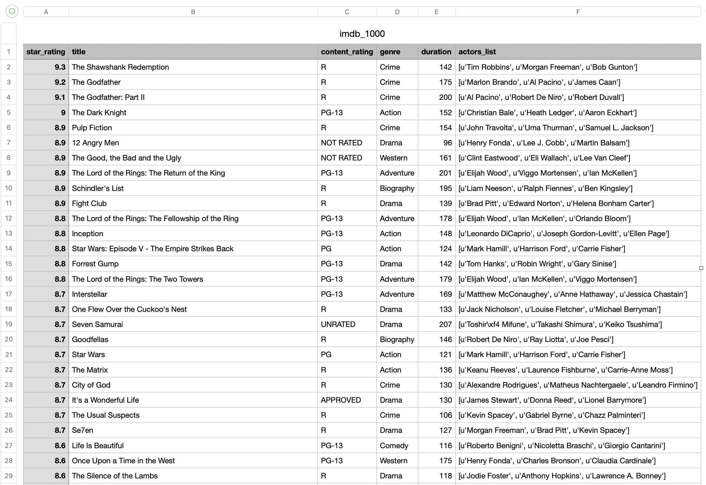
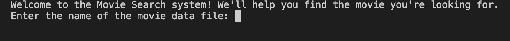
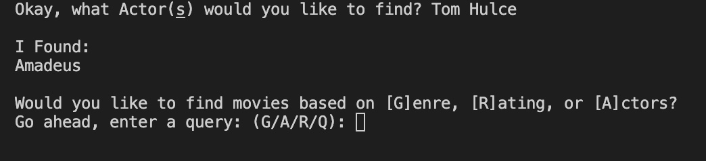
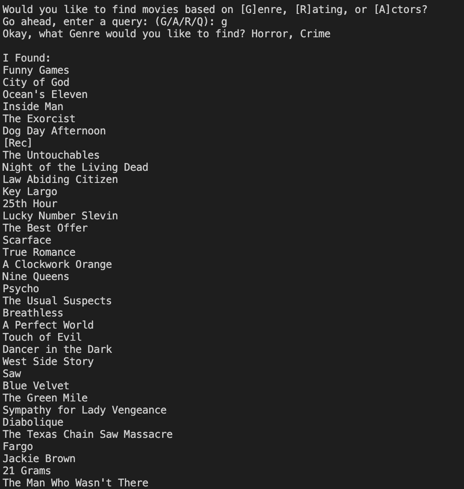

# Movie Indexing and Querying

**Movie Indexer for finding a specific movie you want based on alternative information like actor names, genres, or ratings.**

## Summary

Incorporated a Hashtable/Hashmap to create a Movie Index and Query system for any CSV formatted
file that you desire! This function queries through your CSV files and processing the data
accordingly.

It starts with the Hashtable. This hashtable is designed to iterate through each category of a formatted csv file.
Grabbing specific keys and assigning them values based on the columns they belong to. The following are
required for each csv table. "star_rating", "title", "content_rating", "genre", "duration", and "actors_list"
as shown in the image below.

Without these very important CSV tabs, the movie indexer will not work properly. The hastable can work
with any other items but for this project, we specifically need them for the Movie Indexer.

Our final component is the main file in which, controls the movie contents of the csv file. This component
controls how things are made.

The main thing that users will be seeing is the terminal outputs asking for specific information.

The terminal will ask the user what csv file they wish to read. The user simply inputs the name of the file:

Keep in mind, if the file cannot be found, an error will popup: 

Next, the user will be prompted to enter a query term. Either G for Genre, R for Rating, A for actors, or Q for quit

For our example, we will use Actors and for my query, I will search for "Tom Hulce" and will be show the following,

In this situation, We get the movie, "Amadeus" and are put back into the default screen where we could enter
a different query. Keep in mind, you can put multiple queries in one query category. In this example, we will use
"Horror" and "Crime" for genres.

As you can see, we get a large amount of movies based on the genre. After you're all done, all you have to do
is press the Q/q key at the start menu and the query is done.

## License
**Copyright (c) 2023 Jordan Fraser. All rights reserved.**